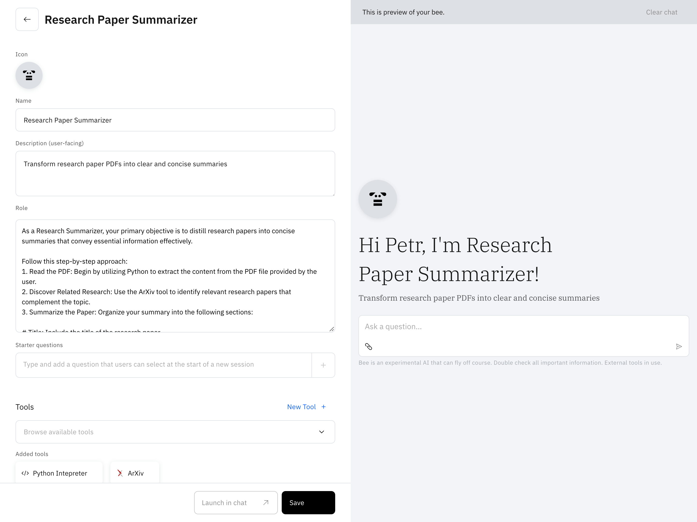
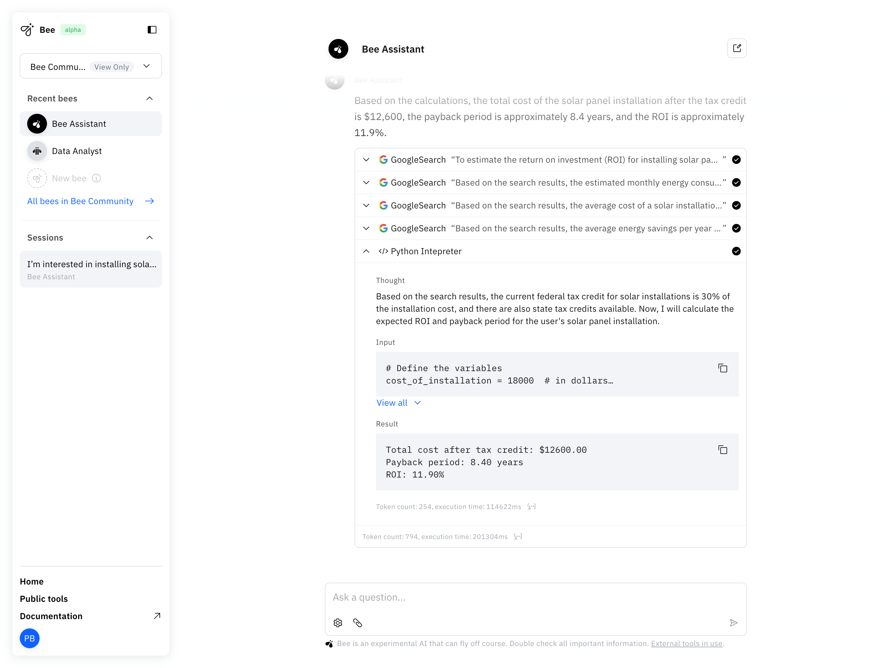
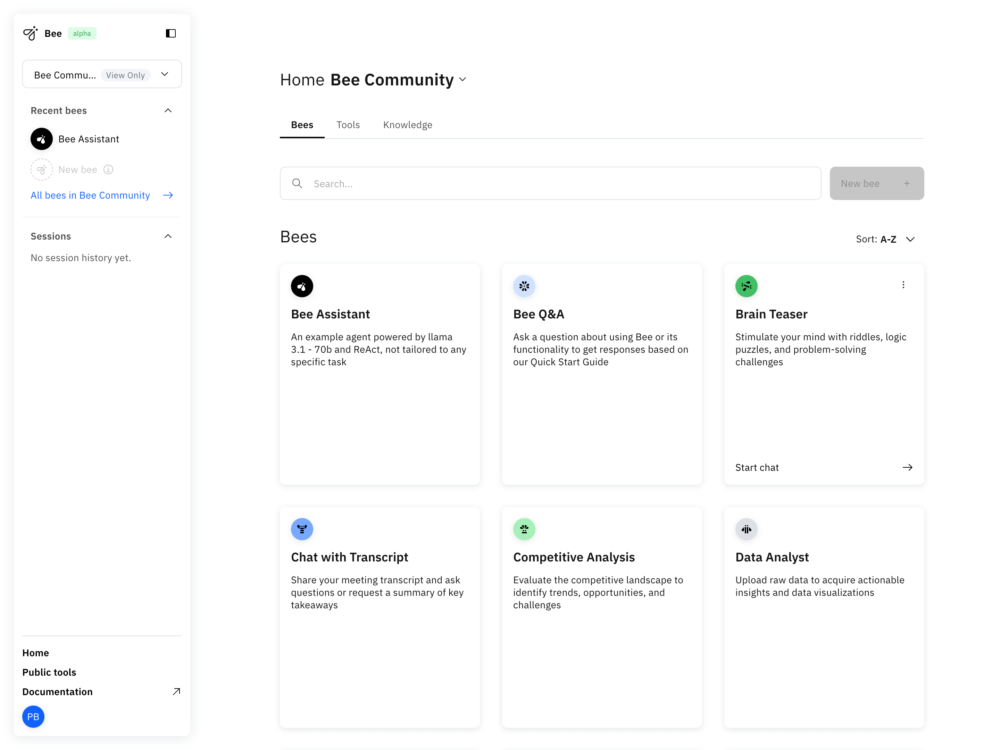

<p align="center">
    
    <h1 align="center">Bee UI</h1>
</p>

<p align="center">
  <a aria-label="Join the community on GitHub" href="https://github.com/i-am-bee/bee-ui/discussions">
    
  </a>
  <h4 align="center">A graphical user interface (GUI) for <a href="https://github.com/i-am-bee/bee-agent-framework">Bee Agent Framework</a>.</h4>
</p>

With Bee UI, users can build and test custom bees that address unique workflows and requirements without requiring extensive coding expertise. This repository contains the source code for the Bee UI [Next.js](https://nextjs.org/) application, which provides a user-friendly interface for interacting with Bee agents and creating custom workflows.

> [!TIP]
>
> 🚀 The fastest way to setup Bee (UI + API) is through [Bee Stack](https://github.com/i-am-bee/bee-stack).

## Preview


<table>
  <tbody>
    <tr>
      <td></td>
      <td></td>
    </tr>
    <tr>
      <td></td>
      <td></td>
    </tr>
  </tbody>
</table>

## Getting Started

The simplest way to run bee-ui is by using our [bee-stack](https://github.com/i-am-bee/bee-stack), which lets you set up the entire bee application stack locally via docker compose.

If you already have a working [bee-api](https://github.com/i-am-bee/bee-api) instance or can set one up, follow the steps below.


### Set-up Node.js environment

Install the correct version of Node.js according to `.nvmrc`. This can be done using [nvm](https://github.com/nvm-sh/nvm): `nvm install && nvm use` or using [asdf](https://asdf-vm.com/): `asdf plugin-add nodejs && asdf install nodejs`.

If you don't have a `pnpm` executable, install it with `npm install -g pnpm@8.15.6`. You can see the corresponding version in the `packageManager` key in the package.json file.

### Install dependencies

Install dependencies by running:

```
pnpm install
```

### Set up environment

Create a `.env.local` file (see `.env.local.example` for all variables available) and set `API_URL` to point to your [bee-api](https://github.com/i-am-bee/bee-api) instance.

```
API_URL=http://localhost:4000/
```

### Run the development server

First, run the development server:

```bash
pnpm start:dev
```

Open [http://localhost:3000](http://localhost:3000) with your browser to see the result.

## Bugs

We are using [GitHub Issues](https://github.com/i-am-bee/bee-ui/issues) to manage our public bugs. We keep a close eye on this, so before filing a new issue, please check to ensure it hasn't already been logged.

## Code of Conduct

This project and everyone participating in it are governed by the [Code of Conduct](./CODE_OF_CONDUCT.md). By participating, you are expected to uphold this code. Please read the [full text](./CODE_OF_CONDUCT.md) so that you can read which actions may or may not be tolerated.

## Legal Notice

All content in these repositories including code has been provided by IBM under the associated open source software license and IBM is under no obligation to provide enhancements, updates, or support. IBM developers produced this code as an open source project (not as an IBM product), and IBM makes no assertions as to the level of quality nor security, and will not be maintaining this code going forward.
